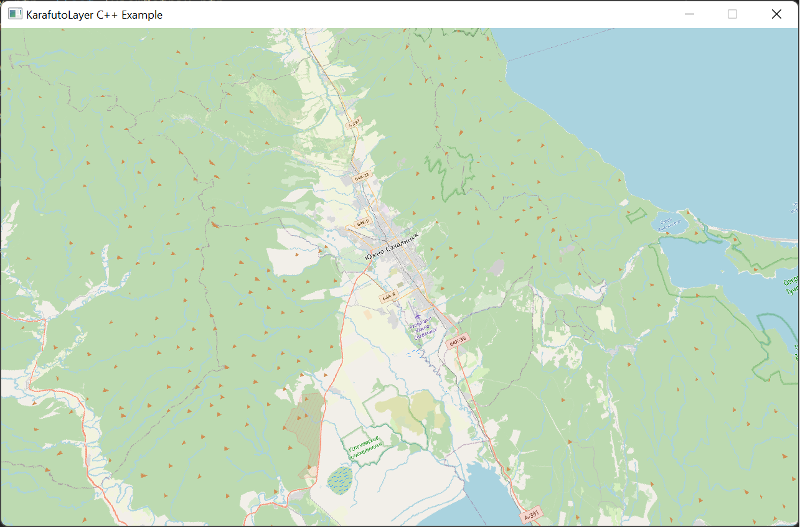
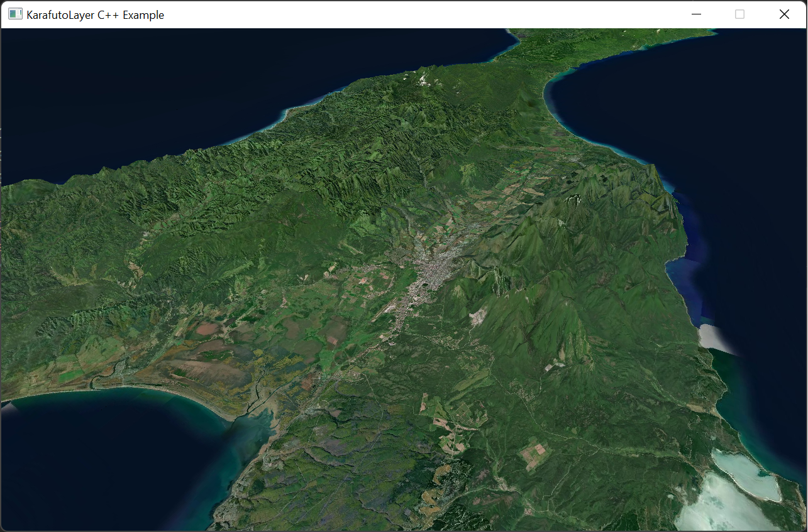

# Karafuto Layer Native C++ Example

Static linking example with the Raylib framework. Based on [Karafuto Layer library](https://github.com/AnKano/karafuto-core).

### How to use

The renderer is configured to use the `assets/elevation` directory in up directory. Place here all unpacked SRTM files and replace the paths inside `Scene.cpp`.
The coordinates of origin are set inside `Scene.cpp` on the outskirts of Yuzhno-Sakhalinsk (46.9641° N, 142.7285° E).
Rendering starts as soon as the compiled application is started.
